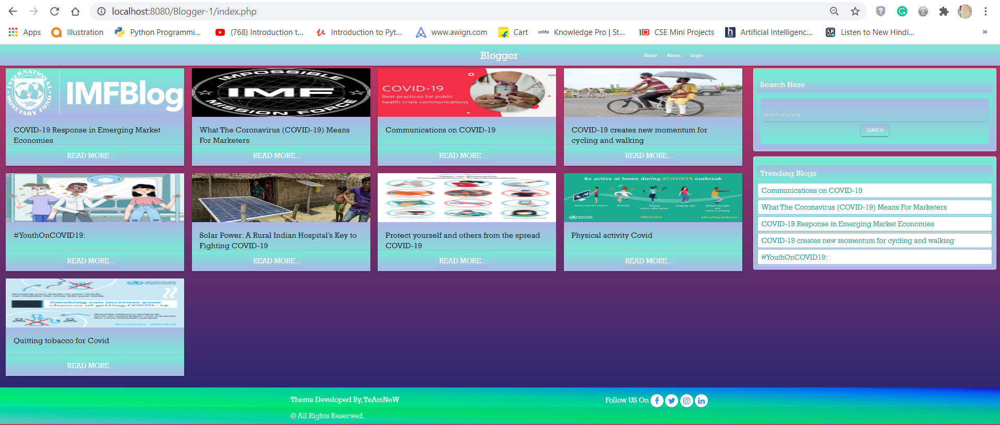

# tEaMnEw
> The Complete Covid-Blog site created For Covid Awreness 

This pandemic has brought suffering, fear, and death to populations everywhere. But its impact is not shared equally. Many of the most vulnerable have already suffered terribly due to a lack of State investment in healthcare for all. Others are living through conflicts, witnessing the erosion of International Humanitarian Law. As humanitarian teams have been partially evacuated and not replaced, those reliant on aid, and those suffering from neglected diseases, are suffering disproportionately. Others have been forced to flee their homes; forced to navigate a world where conventions protecting refugees, asylum seekers and internally displaced people are frequently disregarded, and where little consideration is given to migrants. This pandemic has brought suffering, fear, and death to populations everywhere. But its impact is not shared equally. Today, we must acknowledge that this pandemic comes after years of questioning humanitarian assistance and principles, and innumerable cases of violence against health workers and facilities. 
Healthcare workers all around the world are risking their lives to provide care. Today, we are still facing serious shortages of basic protective equipment. Without proper PPE, we cannot protect our staff and patients.

This is a platform created by us to make sure every struggle during this pandemic is being heard to the people. All the work done by our health workers which has saved so many lives across the nation we provide you a platform to share your struggle and make you an inspiration to the younger generation.

> Category Under Participation is
### Addressing after effects: solutions that address the after effects of COVID-19
> Connectivity: help to keep remote friends/co-workers/family connected
